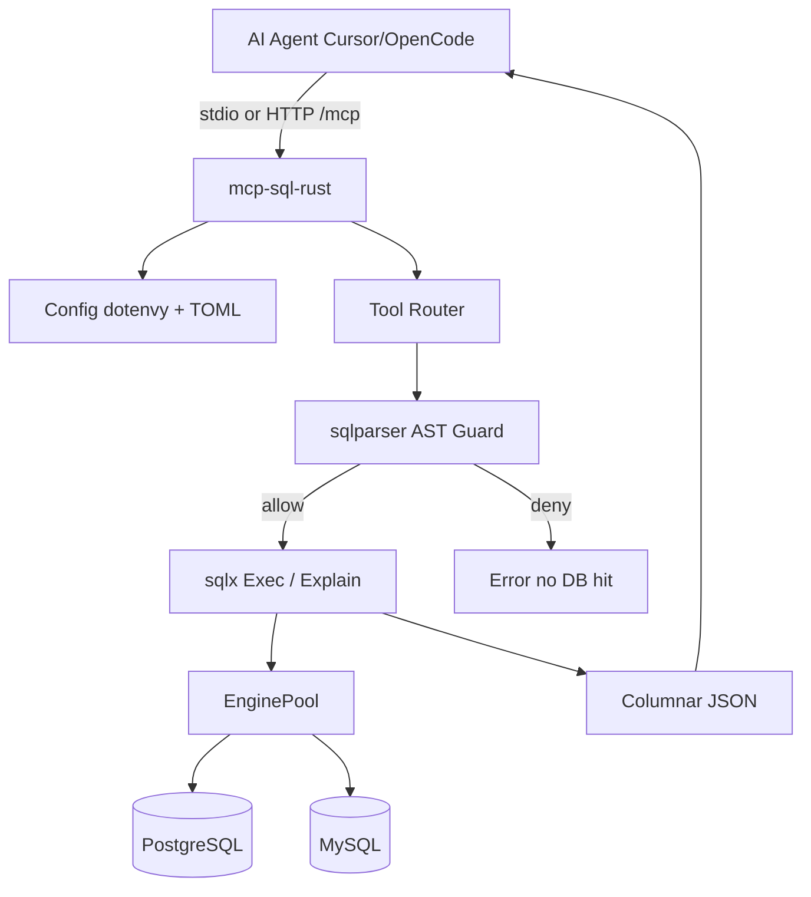

# Architecture — mcp-sql-rust

## Purpose

Expose MySQL and PostgreSQL to AI agents via the [Model Context Protocol](https://modelcontextprotocol.io) with:

- Minimal tool schemas (token-efficient)
- Async concurrency (Tokio + sqlx pools)
- Zero-config credential discovery (`.env`)
- Defense-in-depth SQL safety (AST + session + DB role)

## High-level flow



## Crate layout

```
src/
  main.rs          # clap, tracing, stdio vs HTTP
  lib.rs           # module exports
  config.rs        # WriteMode, .env walk, TOML sources, pools
  server.rs        # rmcp ServerHandler, CORE/FULL tool filter, HTTP
  guard/
    mod.rs         # validate_and_prepare
    classify.rs    # Statement → SqlClass
  db/
    pool.rs        # EngineKind, EnginePool
    exec.rs        # execute_query, execute_batch
    explain.rs     # EXPLAIN → ExplainSummary
    schema.rs      # search_objects / list_* / describe_table
  format/
    columnar.rs    # ColumnarResult + byte truncate
  tools/
    core.rs        # default tool handlers
    full.rs        # --full-tools handlers
```

## Key types

| Type | Location | Role |
|------|----------|------|
| `WriteMode` | `config.rs` | ReadOnly / AllowWrites / AllowDdl |
| `AppConfig` | `config.rs` | Runtime settings + source map |
| `EnginePool` | `db/pool.rs` | `Postgres(PgPool)` \| `Mysql(MySqlPool)` |
| `PreparedSql` | `guard/mod.rs` | Validated SQL + limit_injected |
| `ColumnarResult` | `format/columnar.rs` | Token-efficient rows |
| `McpSqlServer` | `server.rs` | MCP service |

## Request path (`execute_sql`)

1. Resolve `source` → `ResolvedSource`
2. `validate_and_prepare` (dialect parse, classify, enforce WriteMode, LIMIT inject)
3. On deny → return error **without** `pool` checkout
4. On allow → `tokio::time::timeout` + sqlx query/execute
5. Map rows → columnar; truncate by `max_bytes`
6. Return JSON text content block

## Batch path

`queries: string[]` → each string validated independently → `buffer_unordered(batch_concurrency)` → `{results:[...]}`. Fail-soft unless `--fail-fast`.

## Transports

| Mode | Flag | Notes |
|------|------|-------|
| stdio | (default) | Cursor / Claude Desktop |
| Streamable HTTP | `--http 127.0.0.1:8080` | Axum nest `/mcp` |

## Design references

- Safety model inspired by steward-mcp (AST + session RO)
- Tool economy inspired by DBHub (few tools + search_objects)
