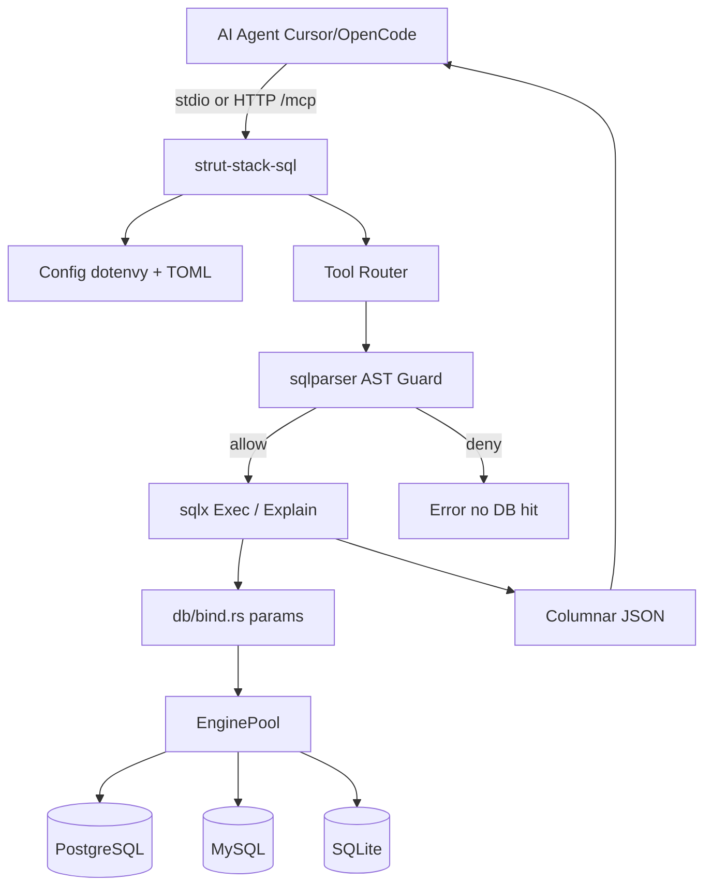

# Architecture — strut-stack-sql

## Purpose

Expose MySQL, PostgreSQL, and SQLite to AI agents via the [Model Context Protocol](https://modelcontextprotocol.io) with:

- Minimal tool schemas (token-efficient)
- Async concurrency (Tokio + sqlx pools)
- Zero-config credential discovery (`.env`)
- Defense-in-depth SQL safety (AST + session + DB role)

## High-level flow



## Crate layout

```
src/
  main.rs          # clap, tracing, stdio vs HTTP
  lib.rs           # module exports
  config.rs        # WriteMode, .env walk, TOML sources, pools
  server.rs        # rmcp ServerHandler, CORE/FULL tool filter, HTTP
  guard/
    mod.rs         # validate_and_prepare (PG/MySQL/SQLite dialects)
    classify.rs    # Statement → SqlClass
    params.rs      # Placeholder count validation
  db/
    pool.rs        # EngineKind, EnginePool
    bind.rs        # sqlx parameter binding (PG/MySQL/SQLite)
    exec.rs        # execute_query, pagination, execute_batch
    explain.rs     # EXPLAIN → ExplainSummary (+ params)
    schema.rs      # search_objects / list_* / describe_table
  format/
    columnar.rs    # ColumnarResult + byte truncate
  tools/
    core.rs        # default tool handlers
    full.rs        # --full-tools handlers
```

## Key types

| Type | Location | Role |
|------|----------|------|
| `WriteMode` | `config.rs` | ReadOnly / AllowWrites / AllowDdl |
| `AppConfig` | `config.rs` | Runtime settings + source map |
| `EnginePool` | `db/pool.rs` | `Postgres` \| `Mysql` \| `Sqlite` pools |
| `PreparedSql` | `guard/mod.rs` | Validated SQL + limit_injected |
| `ColumnarResult` | `format/columnar.rs` | Token-efficient rows |
| `McpSqlServer` | `server.rs` | MCP service |

## Request path (`execute_sql`)

1. Resolve `source` → `ResolvedSource`
2. `validate_and_prepare` (dialect parse, classify, enforce WriteMode, LIMIT inject)
3. On deny → return error **without** `pool` checkout
4. Bind `params` via `db/bind.rs`
5. Apply `page_offset` / `page_size` (single-query mode)
6. On allow → `tokio::time::timeout` + sqlx query/execute
7. Map rows → columnar; truncate by `max_bytes`
8. Return JSON text content block

## Batch path

`queries: string[]` → each string validated independently → `buffer_unordered(batch_concurrency)` → `{results:[...]}`. Fail-soft unless `--fail-fast`. Pagination not supported in batch mode.

## Transports

| Mode | Flag | Notes |
|------|------|-------|
| stdio | (default) | Newline-delimited JSON-RPC (`rmcp`) |
| Streamable HTTP | `--http 127.0.0.1:8080` | Axum nest `/mcp`; `/healthz` pool ping |

## Distribution (v0.4.0)

| Channel | Artifact / entry |
|---------|------------------|
| GitHub Releases | `.tar.gz` (Linux/macOS), `.zip` (Windows), `SHA256SUMS`, `.mcpb` |
| curl | [`install.sh`](../install.sh) |
| Homebrew | `packaging/homebrew/strut-stack-sql.rb` |
| Docker | [`Dockerfile`](../Dockerfile) → `ghcr.io/rzlco666/strut-stack-sql` |
| cargo-binstall | `[package.metadata.binstall]` in `Cargo.toml` |

See [INSTALL.md](INSTALL.md).

## Local dev environment

| Component | Path |
|-----------|------|
| Compose stack | [`docker-compose.yml`](../docker-compose.yml) |
| Seed SQL | [`docker/seed/`](../docker/seed/) |
| Dev Container | [`.devcontainer/`](../.devcontainer/) |

Postgres host port **5433**, MySQL **3307** (avoids conflicts with local DB installs).

## Design references

- Safety model inspired by steward-mcp (AST + session RO)
- Tool economy inspired by DBHub (few tools + search_objects)
