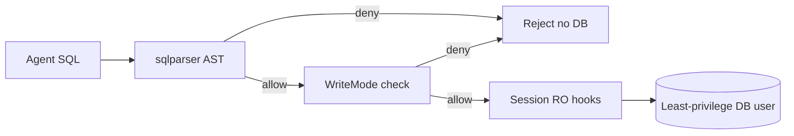

# Security — mcp-sql-rust

## Threat model

AI agents may emit destructive SQL (DROP, mass DELETE, multi-statement smuggling). The server must fail closed by default.

## Defense in depth



### 1. AST guard (`src/guard/`)

- Dialect: `PostgreSqlDialect` / `MySqlDialect`
- Reject empty / multi-statement strings
- Classify: Read / Dml / Ddl / Txn / Other
- Enforce against `WriteMode`
- Inject `LIMIT` on SELECT when missing; clamp explicit `LIMIT` above `--max-rows`
- `EXPLAIN ANALYZE` requires writes
- Batch `queries[]` items are each parsed as a single statement; multi-statement strings are rejected

### 2. Write tiers (CLI)

| Mode | Flag | Allowed |
|------|------|---------|
| ReadOnly | (default) | SELECT, SHOW, DESCRIBE, EXPLAIN |
| AllowWrites | `--allow-writes` | + INSERT/UPDATE/DELETE/MERGE |
| AllowDdl | `--allow-ddl` | + DROP/ALTER/TRUNCATE/CREATE/GRANT… |

Transaction control (`BEGIN`/`COMMIT`/`ROLLBACK`) is always blocked at the guard (agents should not manage txns via MCP in v1).

### 3. Session hardening

- Postgres (when not allowing writes): `SET default_transaction_read_only = on` in `after_connect`
- MySQL (when not allowing writes): `SET SESSION TRANSACTION READ ONLY` in `after_connect`
- Both engines still rely on AST guard + least-privilege DB user

### 4. Operational recommendation

Create a read-only DB role for agent use:

```sql
-- PostgreSQL example
CREATE ROLE mcp_ro LOGIN PASSWORD '...';
GRANT CONNECT ON DATABASE app TO mcp_ro;
GRANT USAGE ON SCHEMA public TO mcp_ro;
GRANT SELECT ON ALL TABLES IN SCHEMA public TO mcp_ro;
```

## Secrets

- Credentials from `.env` / env / TOML `url_env` — never from tool arguments
- Do not log full DSNs
- Do not put passwords in MCP tool schemas or Cursor JSON `args`

## HTTP transport

`--http` binds Streamable HTTP without OAuth in v1. Bind to `127.0.0.1` only unless you add auth.

## Reporting

If you find a guard bypass, open a GitHub issue with a minimal SQL repro (no production credentials).
